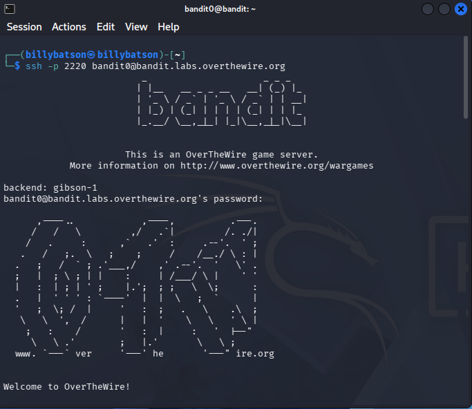

# OverTheWire Bandit: Complete Walkthrough (Level 0 ➜ 34) 

<p align="center">
    
</p>

> ### This repository serves as my personal lab and learning log as I build my Linux CLI navigation from the ground up through **OverTheWire: Bandit**. Every level's walkthrough includes: 

* **🎯 Objective:** Identifying the general direction, target files, and reconnaissance approach.
* **⌨️ Commands used:** Breakdown of commands, flags, pipes, and redirection syntax.
* **💡 Key takeaways:** Understanding debugging strategies, exploiting vulnerabilities and fundamental Linux CLI navigation.

---

## 🌐 **Server Connection:**

### To connect to the OverTheWire Bandit challenge via SSH:

```bash
ssh <User>@<Hostname> -p <Port>
```
### To begin Level 0:
* **User:** `bandit0`
* **Hostname:** `bandit.labs.overthewire.org`
* **Port:** `2220`


The command: `ssh` securely connects to a remote machine over an encrypted channel.

The flag: `-p` sets the target port to whatever comes after it.

